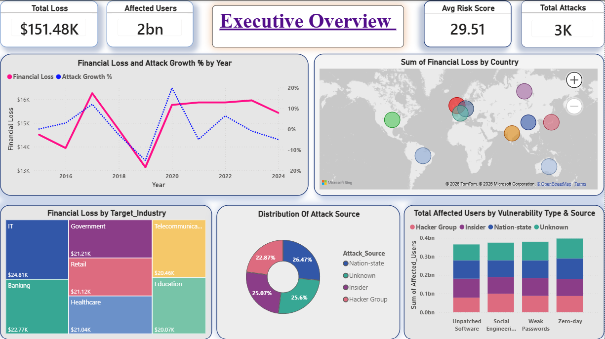
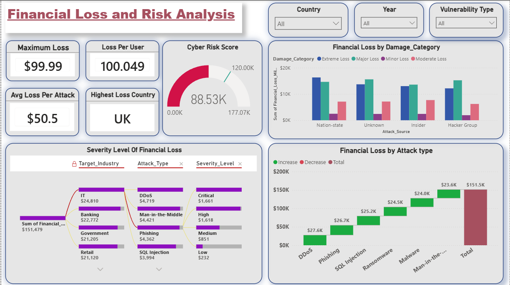
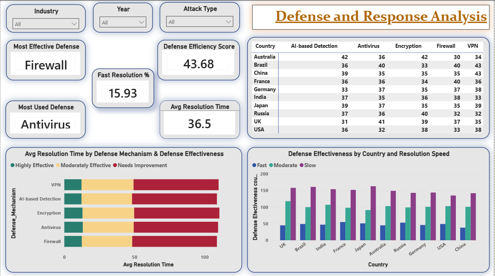

# 🛡️ Global Cybersecurity Threat Analysis Dashboard | Power BI

---

# 📌 Project Overview

The **Global Cybersecurity Threat Analysis Dashboard** is an end-to-end Business Intelligence project developed using **Power BI**.

The objective of this project is to analyze worldwide cybersecurity incidents, financial losses, cyber risks, attack sources, vulnerabilities, and defense mechanisms through interactive dashboards.

The report helps security analysts and decision-makers identify high-risk industries, evaluate attack trends, understand financial impact, and assess the effectiveness of cybersecurity defenses.

---

# 🎯 Business Objectives

- Analyze global cyber attack trends from 2015–2024
- Measure financial impact caused by cyber attacks
- Identify high-risk countries and industries
- Evaluate attack sources and vulnerability patterns
- Assess cybersecurity defense effectiveness
- Build an interactive dashboard for business decision-making

---

# 🛠️ Tools & Technologies

- Microsoft Power BI
- Microsoft Excel
- Power Query
- DAX (Data Analysis Expressions)
- Data Modeling
- Data Visualization

---

# 📂 Dataset Information

The dataset contains information related to:

- Country
- Year
- Attack Type
- Attack Source
- Target Industry
- Vulnerability Type
- Financial Loss
- Affected Users
- Risk Score
- Severity Level
- Defense Mechanism
- Resolution Time
- Defense Effectiveness

---

# ⚙️ Feature Engineering

Additional business features created during analysis:

- Cyber Risk Score
- Severity Level
- Resolution Speed
- Defense Effectiveness
- User Impact Category
- Attack Impact Score

---

# 📊 Dashboard Pages

## 📌 1. Executive Overview

Provides a high-level overview of cyber attack trends and business impact.

### KPIs

- Total Financial Loss
- Total Affected Users
- Average Risk Score
- Total Attacks

### Visuals

- Financial Loss Trend
- Attack Growth %
- Financial Loss by Country
- Financial Loss by Industry
- Attack Source Distribution
- Affected Users by Vulnerability Type

---

## 📌 2. Threat Intelligence Analysis

Focuses on cyber risk and threat patterns.

### KPIs

- Average Impact Score
- Most Common Attack
- Critical Attacks

### Visuals

- Affected Users by Industry
- Risk Score by Severity
- Loss vs Risk Score
- Yearly Affected Users

---

## 📌 3. Financial Loss & Risk Analysis

Analyzes financial impact caused by different cyber attacks.

### KPIs

- Maximum Loss
- Average Loss per Attack
- Loss per User
- Highest Loss Country
- Cyber Risk Score

### Visuals

- Financial Loss by Damage Category
- Sankey Diagram
- Waterfall Chart
- Financial Loss by Attack Type

---

## 📌 4. Defense & Response Analysis

Evaluates cybersecurity defense mechanisms.

### KPIs

- Most Effective Defense
- Most Used Defense
- Defense Efficiency Score
- Fast Resolution %
- Average Resolution Time

### Visuals

- Defense Effectiveness by Country
- Resolution Time Analysis
- Country-wise Defense Comparison
- Defense Mechanism Performance

---

# 📈 Key Insights

### Executive Overview

- Financial losses have increased significantly after 2019.
- Global cyber attacks continue to rise year after year.
- Risk scores remain consistently high across recent years.
- Financial losses are geographically distributed across multiple countries.

---

### Threat Intelligence

- **DDoS** is the most common attack type.
- IT and Banking industries experience the highest number of affected users.
- Critical vulnerabilities produce the highest average cyber risk score.
- Higher cyber risk scores strongly correlate with larger financial losses.

---

### Financial Loss Analysis

- The **United Kingdom** records the highest cumulative financial loss.
- IT sector suffers the greatest financial impact.
- Nation-state and Unknown attackers contribute significantly to total losses.
- Critical severity attacks generate the highest financial damage.

---

### Defense Analysis

- **Firewall** is identified as the most effective defense mechanism.
- **Antivirus** is the most widely deployed security solution.
- Countries implementing stronger defense mechanisms achieve faster incident resolution.
- AI-based detection demonstrates promising effectiveness across multiple regions.

---

# 💡 Business Recommendations

- Strengthen protection against DDoS attacks using scalable mitigation services.
- Prioritize patch management to reduce risks from unpatched software.
- Invest in employee awareness programs to reduce social engineering attacks.
- Expand AI-powered threat detection capabilities.
- Focus cybersecurity investments on high-risk industries such as IT and Banking.
- Improve incident response times through automated security operations.

---

## Executive Overview

---

## Threat Intelligence Analysis

---

## Financial Loss & Risk Analysis

---

## Defense & Response Analysis

---

# 🚀 Skills Demonstrated

- Data Cleaning
- Data Transformation
- Feature Engineering
- Power Query
- Data Modeling
- DAX
- Interactive Dashboard Design
- KPI Development
- Business Intelligence
- Data Visualization
- Analytical Storytelling

---

# 📚 Learning Outcomes

Through this project, I gained hands-on experience in:

- Designing enterprise-level Power BI dashboards
- Creating advanced DAX measures
- Building interactive reports
- Performing cybersecurity data analysis
- Developing business-oriented KPIs
- Presenting insights using data visualization

---

# 👨‍💻 Author

**Debopam Rath**

Aspiring Data Analyst | Business Intelligence Analyst | Data Science Enthusiast

📧 Email: debopamcareer99@gmail.com

🔗 LinkedIn: www.linkedin.com/in/debopam-rath-9310b9355

---

⭐ If you found this project useful, consider giving it a **Star**!
